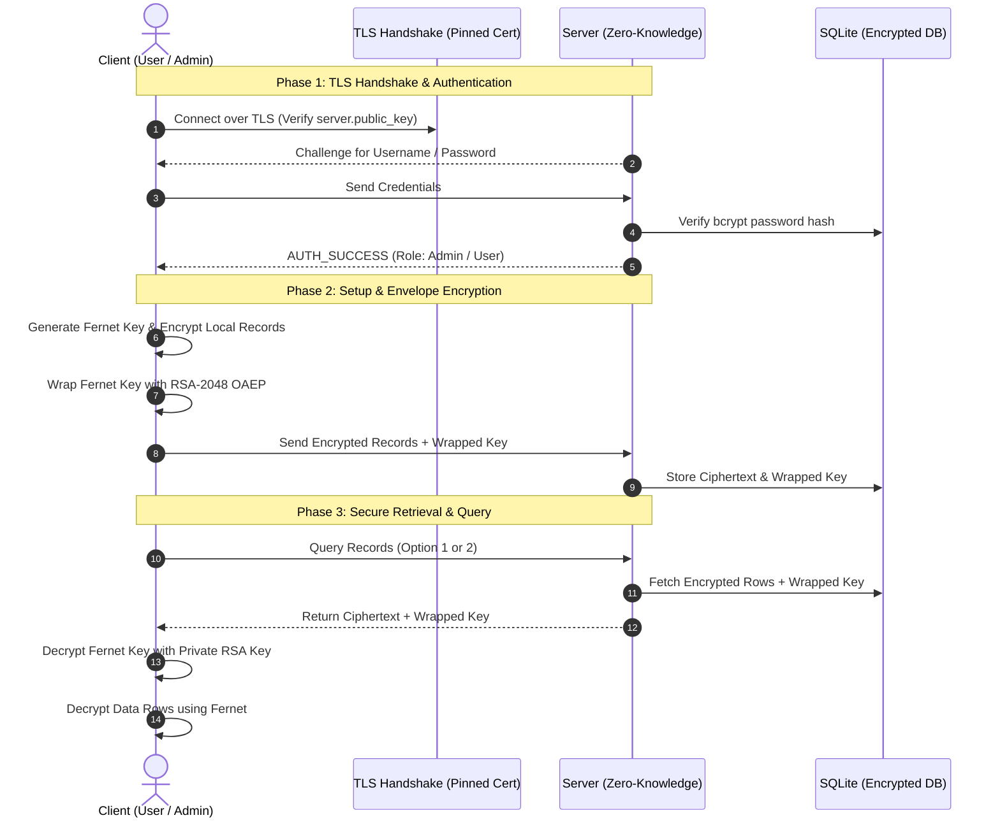

#  Zero-Knowledge Secure Database & Key Management System

A secure client-server database system featuring **End-to-End & Envelope Encryption**, **Zero-Knowledge Server Architecture**, **Role-Based Access Control (RBAC)**, and an **Asymmetric Key Delegation Mailbox**. 

Developed with Python, SQLite, Cryptography (Fernet & RSA-2048 OAEP), and Containerized with Docker.

---

##  Key Security Features

- **Zero-Knowledge Server (Data-at-Rest Protection):** The server stores and manages data, but never possesses the plaintext data nor the symmetric keys required to decrypt it.
- **Envelope / Hybrid Encryption:**
  - **Data Layer:** High-speed symmetric encryption using **Fernet (AES-128-CBC + HMAC-SHA256)** for database records.
  - **Key Wrapping Layer:** The symmetric Fernet key is wrapped (encrypted) using **RSA-2048 with OAEP (SHA-256)** using the client's public key (and optionally the admin's key).
- **Secure Transport (TLS with Certificate Pinning):** Communication between client and server is encrypted in-transit over TLS 1.3/TCP sockets. The client performs **Certificate Pinning** against the server's public key, preventing Man-in-the-Middle (MITM) attacks without requiring a commercial CA.
- **Asymmetric Key Delegation (Secure Mailbox):**
  - Users can securely share access to their records without exposing their private keys or master passwords.
  - User A sends an access request with their RSA public key.
  - User B re-encrypts their Fernet key with User A's public key and deposits it into User A's server mailbox.
  - **Single-Use Key Delegation:** Once consumed, the delegation key is immediately purged from the server mailbox.
- **Anti-Replay Attack Protection:** Timestamp validation window ($\Delta t \le 300\text{s}$) to prevent replay attacks on access requests.
- **Identity & Credential Protection:**
  - Passwords hashed with **bcrypt** (salt included) to thwart dictionary and rainbow table attacks.
  - All database interactions use **Parameterized Queries** to prevent SQL Injection.
  - Brute-force protection: Connection is dropped after 3 failed login attempts.

---

##  Architecture & Communication Flow



---

##  Threat Model & Security Mitigations

| Threat / Attack Vector | Risk | Mitigation in System |
| :--- | :--- | :--- |
| **Man-in-the-Middle (MITM)** | Eavesdropping / tampering with packets in-flight | TLS 1.3 socket wrapper with pinned X.509 certificate (`server.public_key`). |
| **Server Compromise / Rogue DBA** | Attacker reads raw database entries | **Zero-Knowledge Envelope Encryption**: Data is stored as Fernet ciphertext. Fernet keys are RSA-wrapped; server holds no private keys. |
| **SQL Injection** | Arbitrary SQL execution | **Parameterized Queries (`?`)** used for all queries. |
| **Password Dumping / Rainbow Tables** | Offline brute-force of stolen passwords | **bcrypt** hashing with automatic per-user salt generation. |
| **Replay Attacks** | Re-sending intercepted authorization payloads | Strict **Unix timestamp verification (`abs(now - timestamp) <= 300s`)**. |
| **Privilege Escalation** | Unauthorized reading of another user's rows | **RBAC Enforcement**: Regular users can only access rows matching `owner = current_user` unless explicitly granted a single-use delegated key via the Mailbox. |

---

##  Demo Accounts & Roles

The system automatically initializes default test users upon first launch:

| Username | Password | Role | Description |
| :--- | :--- | :--- | :--- |
| `admin` | `admin123` | **admin** | Has administrative rights to inspect all user records if encrypted with admin's key. |
| `user1` | `user11` | **user** | Standard user account. |
| `user2` | `user12` | **user** | Standard user account. |
| `user3` | `user13` | **user** | Standard user account. |
| `user4` | `user14` | **user** | Standard user account. |
| `user5` | `user15` | **user** | Standard user account. |

---

##  Getting Started

### Prerequisites
- Python 3.10+
- (Optional) Docker & Docker Desktop

### 1. Installation
Clone this repository and install required dependencies:
```bash
git clone https://github.com/<your-username>/Data_Base_Encryption.git
cd Data_Base_Encryption
pip install -r requirements.txt
```

### 2. Generate Server Certificate
Before launching the server for the first time, generate the self-signed X.509 server certificate and RSA private key:
```bash
python key_generation.py
```
*(This produces `server.private_key` and `server.public_key`).*

---

## Running the Application

### Option A: Running with Docker (Recommended for Server)

1. **Build the Docker Image:**
   ```bash
   docker build -t secure-db-server .
   ```

2. **Run the Container:**
   ```bash
   docker run --rm -p 5000:5000 --name secure-server secure-db-server
   ```

3. **Follow Server Logs (Real-time):**
   ```bash
   docker logs -f secure-server
   ```

4. **Launch Client in a local terminal:**
   ```bash
   python client_Re.py
   ```

---

### Option B: Running Locally (Without Docker)

1. **Start the Server:**
   ```bash
   python server.py
   ```

2. **Start the Client (in another terminal):**
   ```bash
   python client_Re.py
   ```

---

## 📂 Project Structure

```
├── Dockerfile              # Containerization definition for Server
├── requirements.txt        # Python package dependencies (cryptography, bcrypt, Faker)
├── server.py               # TLS Server, DB operations, RBAC, Mailbox & Socket Handler
├── client_Re.py            # Client application with local RSA key generation & menu
├── key_generation.py       # Generates self-signed X.509 certificate for TLS
├── basic_encryption.py     # Standalone proof-of-concept for SQLite in-memory encryption
├── .gitignore              # Excludes keys, databases, virtual environments and caches
└── README.md               # Project documentation
```

---

## 📜 License
This project was developed for academic and educational purposes.
